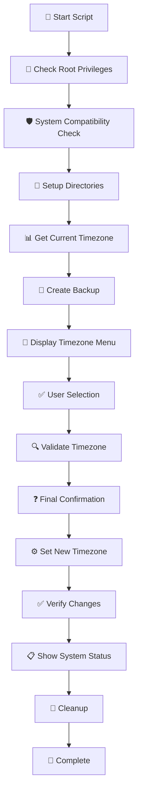

# 🕐 Linux Timezone Setup Script

<div align="center">


**🌍 Comprehensive Linux Server Timezone Configuration Tool**

*Kapsamlı Linux Sunucu Saat Dilimi Yapılandırma Aracı*

[English](#english) | [Türkçe](#türkçe)

</div>

---

## English

### 📋 Overview

The **Linux Timezone Setup Script** is a comprehensive, interactive tool designed to safely configure timezone settings on Linux servers. Built with robust error handling, detailed logging, and user-friendly interface, this script ensures a smooth timezone configuration experience.

### ✨ Key Features

- 🔐 **Root Permission Check** - Automatically verifies administrative privileges
- 🛡️ **System Compatibility** - Works with systemd-based Linux distributions
- 📊 **Progress Tracking** - Visual progress bars with step-by-step updates
- 📝 **Detailed Logging** - Comprehensive logs stored in `/var/log/timezone-setup/`
- 🎯 **Interactive Menu** - User-friendly colored interface with timezone selection
- 💾 **Automatic Backup** - Creates system backups before making changes
- 🧹 **Cleanup Process** - Automatic cleanup of temporary files and directories
- ✅ **Verification** - Validates timezone changes and system status
- 🌐 **Popular Timezones** - Pre-configured list of commonly used timezones
- 🔍 **Manual Entry** - Option to manually enter any valid timezone

### 🚀 Quick Start

#### Method 1: Using curl
```bash
# Download and run directly
curl -fsSL https://raw.githubusercontent.com/MRsuffixx/linux-timezone-setup/main/timezone-setup.sh | sudo bash
```

#### Method 2: Using wget
```bash
# Download and run directly
wget -qO- https://raw.githubusercontent.com/MRsuffixx/linux-timezone-setup/main/timezone-setup.sh | sudo bash
```

#### Method 3: Download and Execute
```bash
# Download the script
curl -fsSL -o timezone-setup.sh https://raw.githubusercontent.com/MRsuffixx/linux-timezone-setup/main/timezone-setup.sh

# Make it executable
chmod +x timezone-setup.sh

# Run the script
sudo ./timezone-setup.sh
```

### 🔧 Installation

1. **Clone the repository:**
   ```bash
   git clone https://github.com/MRsuffixx/linux-timezone-setup.git
   cd linux-timezone-setup
   ```

2. **Make the script executable:**
   ```bash
   chmod +x timezone-setup.sh
   ```

3. **Run the script:**
   ```bash
   sudo ./timezone-setup.sh
   ```

### 📊 Script Workflow



### 🌍 Supported Timezones

The script includes popular timezones by default:

| Option | Timezone | Description |
|--------|----------|-------------|
| 1 | `Europe/Istanbul` | Turkey (GMT+3) |
| 2 | `UTC` | Coordinated Universal Time |
| 3 | `Europe/London` | United Kingdom (GMT+0/+1) |
| 4 | `Europe/Berlin` | Germany (GMT+1/+2) |
| 5 | `America/New_York` | Eastern US (GMT-5/-4) |
| 6 | `America/Los_Angeles` | Western US (GMT-8/-7) |
| 7 | `Asia/Tokyo` | Japan (GMT+9) |
| 8 | `Australia/Sydney` | Australia (GMT+10/+11) |
| 9 | `Europe/Moscow` | Russia (GMT+3) |
| 10 | `Asia/Dubai` | UAE (GMT+4) |
| 11 | Manual Entry | Enter any valid timezone |
| 12 | List All | View all available timezones |

### 📁 File Structure

```
/var/log/timezone-setup/
├── timezone-setup.log          # Detailed operation logs

/var/backups/timezone-setup/
├── timezone_backup_YYYYMMDD_HHMMSS.tar.gz    # System backups

/tmp/timezone-setup-PID/
├── [temporary files]           # Cleaned up automatically
```

### 🔍 Log Levels

- **INFO** 🔵 - General information and progress updates
- **SUCCESS** ✅ - Successful operations
- **WARN** ⚠️ - Warnings and non-critical issues
- **ERROR** ❌ - Critical errors and failures
- **DEBUG** 🔧 - Detailed debugging information

### 🛠️ Requirements

- **Operating System:** Linux (systemd-based)
- **Privileges:** Root access required
- **Dependencies:** 
  - `timedatectl` (systemd)
  - Standard Linux utilities (`date`, `ln`, `cp`, `mv`, `mkdir`, `rm`, `find`)

### 🐛 Troubleshooting

#### Common Issues:

1. **Permission Denied**
   ```bash
   # Solution: Run with sudo
   sudo ./timezone-setup.sh
   ```

2. **Command Not Found: timedatectl**
   ```bash
   # Your system might not be systemd-based
   # Check your system type
   ps --no-headers -o comm 1
   ```

3. **Invalid Timezone**
   ```bash
   # List all available timezones
   timedatectl list-timezones
   ```

### 📄 License

This project is licensed under the MIT License - see the [LICENSE](LICENSE) file for details.

### 🤝 Contributing

Contributions are welcome! Please feel free to submit a Pull Request.

1. Fork the project
2. Create your feature branch (`git checkout -b feature/AmazingFeature`)
3. Commit your changes (`git commit -m 'Add some AmazingFeature'`)
4. Push to the branch (`git push origin feature/AmazingFeature`)
5. Open a Pull Request

### 📞 Support

If you encounter any issues or have questions, please [open an issue](https://github.com/MRsuffixx/linux-timezone-setup/issues) on GitHub.

---

## Türkçe

### 📋 Genel Bakış

**Linux Saat Dilimi Kurulum Scripti**, Linux sunucularında saat dilimi ayarlarını güvenli bir şekilde yapılandırmak için tasarlanmış kapsamlı, etkileşimli bir araçtır. Güçlü hata işleme, detaylı loglama ve kullanıcı dostu arayüz ile oluşturulmuş bu script, sorunsuz bir saat dilimi yapılandırma deneyimi sağlar.

### ✨ Temel Özellikler

- 🔐 **Root Yetki Kontrolü** - Yönetici yetkilerini otomatik olarak doğrular
- 🛡️ **Sistem Uyumluluğu** - Systemd tabanlı Linux dağıtımlarında çalışır
- 📊 **İlerleme Takibi** - Adım adım güncellemeler ile görsel ilerleme çubukları
- 📝 **Detaylı Loglama** - `/var/log/timezone-setup/` dizininde kapsamlı loglar
- 🎯 **Etkileşimli Menü** - Saat dilimi seçimi için kullanıcı dostu renkli arayüz
- 💾 **Otomatik Yedekleme** - Değişiklik yapmadan önce sistem yedekleri oluşturur
- 🧹 **Temizlik İşlemi** - Geçici dosya ve dizinlerin otomatik temizlenmesi
- ✅ **Doğrulama** - Saat dilimi değişikliklerini ve sistem durumunu doğrular
- 🌐 **Popüler Saat Dilimleri** - Yaygın kullanılan saat dilimlerinin önceden yapılandırılmış listesi
- 🔍 **Manuel Giriş** - Herhangi bir geçerli saat dilimini manuel olarak girme seçeneği

### 🚀 Hızlı Başlangıç

#### Yöntem 1: curl Kullanarak
```bash
# Doğrudan indir ve çalıştır
curl -fsSL https://raw.githubusercontent.com/MRsuffixx/linux-timezone-setup/main/timezone-setup.sh | sudo bash
```

#### Yöntem 2: wget Kullanarak
```bash
# Doğrudan indir ve çalıştır
wget -qO- https://raw.githubusercontent.com/MRsuffixx/linux-timezone-setup/main/timezone-setup.sh | sudo bash
```

#### Yöntem 3: İndir ve Çalıştır
```bash
# Scripti indir
curl -fsSL -o timezone-setup.sh https://raw.githubusercontent.com/MRsuffixx/linux-timezone-setup/main/timezone-setup.sh

# Çalıştırılabilir yap
chmod +x timezone-setup.sh

# Scripti çalıştır
sudo ./timezone-setup.sh
```

### 🔧 Kurulum

1. **Repository'yi klonlayın:**
   ```bash
   git clone https://github.com/MRsuffixx/linux-timezone-setup.git
   cd linux-timezone-setup
   ```

2. **Scripti çalıştırılabilir hale getirin:**
   ```bash
   chmod +x timezone-setup.sh
   ```

3. **Scripti çalıştırın:**
   ```bash
   sudo ./timezone-setup.sh
   ```

### 📊 Script İş Akışı

Script aşağıdaki adımları izler:

1. 🔐 **Root Yetki Kontrolü** - Yönetici yetkilerini kontrol eder
2. 🛡️ **Sistem Uyumluluğu** - Sistemin systemd tabanlı olup olmadığını kontrol eder
3. 📁 **Dizin Kurulumu** - Gerekli log ve yedek dizinlerini oluşturur
4. 📊 **Mevcut Saat Dilimi** - Sistem saat dilimini tespit eder
5. 💾 **Yedek Oluşturma** - Sistem ayarlarının yedeğini alır
6. 🎯 **Saat Dilimi Menüsü** - Kullanıcıya seçenekleri sunar
7. ✅ **Kullanıcı Seçimi** - Saat dilimi seçimini doğrular
8. ❓ **Son Onay** - Değişiklikleri onaylatır
9. ⚙️ **Saat Dilimi Ayarlama** - Yeni saat dilimini uygular
10. ✅ **Doğrulama** - Değişiklikleri kontrol eder
11. 📋 **Sistem Durumu** - Güncel durumu gösterir
12. 🧹 **Temizlik** - Geçici dosyaları temizler

### 🌍 Desteklenen Saat Dilimleri

Script varsayılan olarak popüler saat dilimlerini içerir:

| Seçenek | Saat Dilimi | Açıklama |
|---------|-------------|----------|
| 1 | `Europe/Istanbul` | Türkiye (GMT+3) |
| 2 | `UTC` | Koordineli Evrensel Zaman |
| 3 | `Europe/London` | İngiltere (GMT+0/+1) |
| 4 | `Europe/Berlin` | Almanya (GMT+1/+2) |
| 5 | `America/New_York` | Doğu ABD (GMT-5/-4) |
| 6 | `America/Los_Angeles` | Batı ABD (GMT-8/-7) |
| 7 | `Asia/Tokyo` | Japonya (GMT+9) |
| 8 | `Australia/Sydney` | Avustralya (GMT+10/+11) |
| 9 | `Europe/Moscow` | Rusya (GMT+3) |
| 10 | `Asia/Dubai` | BAE (GMT+4) |
| 11 | Manuel Giriş | Herhangi bir geçerli saat dilimi girin |
| 12 | Tümünü Listele | Tüm mevcut saat dilimlerini görüntüle |

### 📁 Dosya Yapısı

```
/var/log/timezone-setup/
├── timezone-setup.log          # Detaylı işlem logları

/var/backups/timezone-setup/
├── timezone_backup_YYYYMMDD_HHMMSS.tar.gz    # Sistem yedekleri

/tmp/timezone-setup-PID/
├── [geçici dosyalar]           # Otomatik olarak temizlenir
```

### 🔍 Log Seviyeleri

- **INFO** 🔵 - Genel bilgi ve ilerleme güncellemeleri
- **SUCCESS** ✅ - Başarılı işlemler
- **WARN** ⚠️ - Uyarılar ve kritik olmayan sorunlar
- **ERROR** ❌ - Kritik hatalar ve başarısızlıklar
- **DEBUG** 🔧 - Detaylı hata ayıklama bilgileri

### 🛠️ Gereksinimler

- **İşletim Sistemi:** Linux (systemd tabanlı)
- **Yetkiler:** Root erişimi gerekli
- **Bağımlılıklar:** 
  - `timedatectl` (systemd)
  - Standart Linux araçları (`date`, `ln`, `cp`, `mv`, `mkdir`, `rm`, `find`)

### 🐛 Sorun Giderme

#### Yaygın Sorunlar:

1. **İzin Reddedildi**
   ```bash
   # Çözüm: sudo ile çalıştırın
   sudo ./timezone-setup.sh
   ```

2. **Komut Bulunamadı: timedatectl**
   ```bash
   # Sisteminiz systemd tabanlı olmayabilir
   # Sistem tipinizi kontrol edin
   ps --no-headers -o comm 1
   ```

3. **Geçersiz Saat Dilimi**
   ```bash
   # Tüm mevcut saat dilimlerini listeleyin
   timedatectl list-timezones
   ```

### 📄 Lisans

Bu proje MIT Lisansı altında lisanslanmıştır - detaylar için [LICENSE](LICENSE) dosyasına bakın.

### 🤝 Katkıda Bulunma

Katkılar memnuniyetle karşılanır! Lütfen Pull Request göndermekten çekinmeyin.

1. Projeyi fork edin
2. Feature branch'inizi oluşturun (`git checkout -b feature/HarikaBirOzellik`)
3. Değişikliklerinizi commit edin (`git commit -m 'Harika bir özellik ekle'`)
4. Branch'inizi push edin (`git push origin feature/HarikaBirOzellik`)
5. Bir Pull Request açın

### 📞 Destek

Herhangi bir sorunla karşılaşırsanız veya sorularınız varsa, lütfen GitHub'da [bir issue açın](https://github.com/MRsuffixx/linux-timezone-setup/issues).

---

<div align="center">

### 🌟 Star this repository if you find it helpful!

**Made with ❤️ for the Linux community**

[⬆ Back to top](#-linux-timezone-setup-script)

</div>
